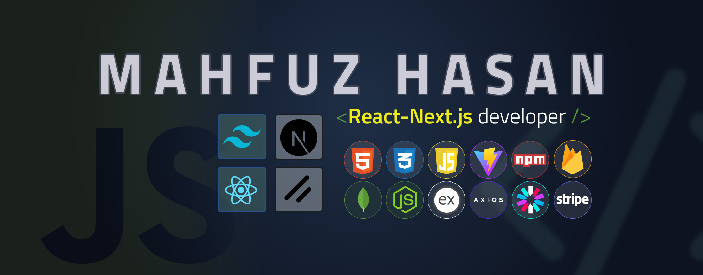

  

  

---

## 📫 Get in Touch

  
  
  
  
  
  
  

 

###

I'm a passionate Frontend Developer with expertise in JavaScript, React, and modern UI/UX principles. I enjoy solving bugs, tackling complex problems, and exploring new technologies to build seamless and user-friendly web applications. My focus is not just on delivering or completing projects, but on ensuring high quality and long-term value in everything I build.

- 📚 I'm currently learning Redux and GSAP.  
- 💡 **Fun fact:** `{ "status": 102, "message": "request under processing" }`

---

## 📊 GitHub Stats

### Most Used Languages

---

Thank you for visiting! ✨

